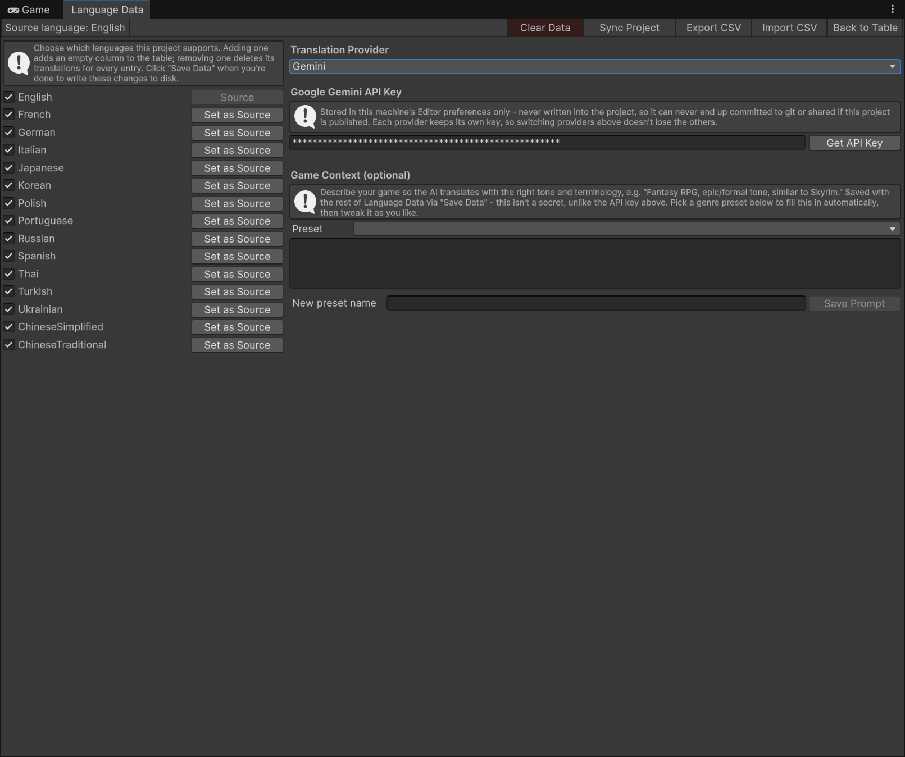
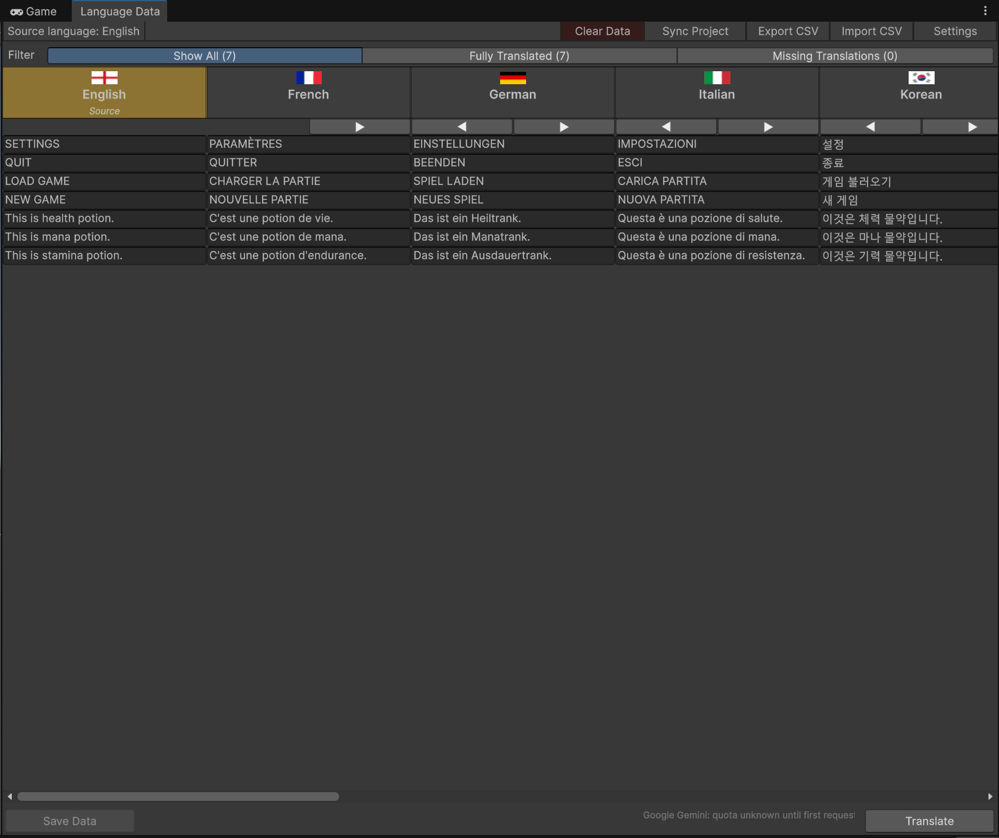

# EasyLocalize

Scan, translate, and live-switch languages in Unity — for scene text and code-driven strings alike, all from one Editor window.


## Overview

EasyLocalize finds every translatable string in your project — `Text`/`TextMeshProUGUI` components in your scenes **and** any `string` field marked with `[Localize]` in your own scripts (MonoBehaviours, ScriptableObjects, even fields nested inside plain serializable classes) — and brings them all into a single Editor table.

From that table you can translate everything with one click using Gemini, OpenAI, Claude, Google Translate, or DeepL, with automatic fallback to another provider if one runs out of quota mid-run. At runtime, a small set of components (`LocalizedText`, `LanguageDropdown`) apply the selected language instantly and keep it in sync whenever the player switches, with the last choice remembered between sessions.

## Features

- **Two scan sources, one table** — scene `Text`/`TMP_Text` components and `[Localize]`-attributed code fields are discovered together with a single **Sync Project** button
- **Five translation providers built in** — Gemini, OpenAI, Claude, Google Translate, and DeepL, selectable per project, with automatic fallback to the next available provider when one hits its rate limit
- **Runtime language switching, no manual wiring** — drop a `LanguageDropdown` on any `Dropdown`/`TMP_Dropdown` and every localized `Text`/`TMP_Text` updates the instant the player picks a language; the choice persists across sessions
- **Rename-proof keys** — scene text keeps a stable GUID key regardless of hierarchy or renames, and code-driven strings key off their own source text, so refactors never orphan a translation
- **Filtering, CSV import/export, and virtualized rows** — filter by fully translated / missing, hand a spreadsheet to a human translator and import the results back, and browse large translation tables without Editor slowdown
- **Opt out per-object** — an `ExcludeFromLocalization` marker component keeps specific text (e.g. a Dropdown's own label) out of the scan entirely

## Setup

### Requirements

- Unity 2021.3 LTS or newer
- TextMeshPro package (`com.unity.textmeshpro`) — included by default in modern Unity projects
- An API key for at least one translation provider (Gemini, OpenAI, Claude, Google Translate, or DeepL) if you want to use in-Editor translation

### Installation

Clone or download this repository, then copy the `LocalizationSystem` folder into your project's `Assets/` (e.g. `Assets/LocalizationSystem`). It's self-contained via its own Runtime/Editor assembly definitions — no other setup is required.

## Quick Start

1. Open **Tools > Localization System > Language Data**.

2. Go to **Settings**, pick the languages your project supports, choose a translation provider, and paste its API key.



3. Back in the main table, click **Sync Project**. This scans your open scene for `Text`/`TextMeshProUGUI` components and searches your code for any field marked with `[Localize]`. Every match appears as a row, with your source language already filled in and every other language left empty:

```csharp
using LocalizationSystem;

public class ItemData : ScriptableObject
{
    [Localize] public string ItemName = "Health Potion";
    [Localize] public string ItemDescription = "Restores 50 HP.";
}
```

4. Click **Translate**. Missing translations are filled in for every language you added in step 2.



5. To let players change languages at runtime, add a `LanguageDropdown` component next to any `Dropdown`/`TMP_Dropdown` in your scene. It fills itself with your project's languages and switches every localized text the moment one is picked.

6. If your own code assigns a `[Localize]`-marked string to a `Text`/`TMP_Text` yourself (instead of one already wired up by Sync Project), add a `LocalizedText` component to that object and call `SetKey` rather than assigning `.text` directly:

```csharp
label.GetComponent<LocalizedText>().SetKey(itemData.ItemName);
```

## License

This project is licensed under the [MIT License](LICENSE).
